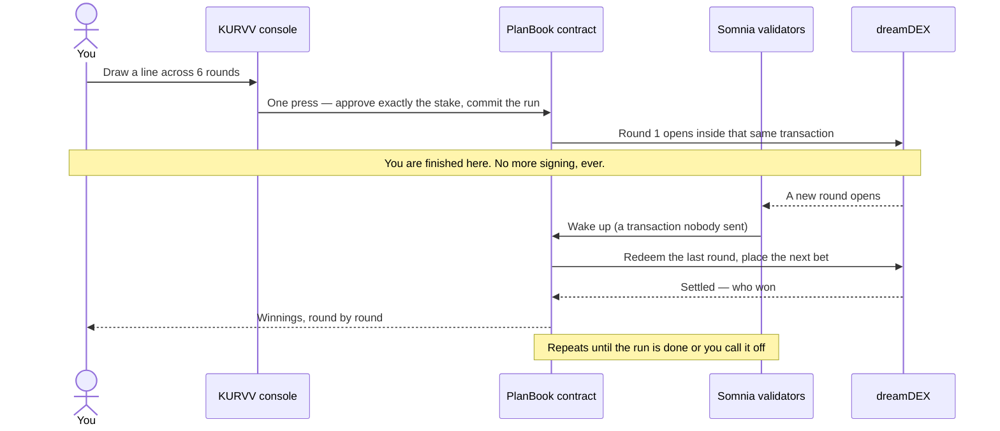

<div align="center">
<picture>
  <source media="(prefers-color-scheme: dark)" srcset="./web/public/kurvv.svg">
  
</picture>


### **Draw the market. The chain trades it.**

<br>

[](https://kurvv.vercel.app/play)
[](./LICENSE)
[](https://shannon-explorer.somnia.network)
[](#the-contracts)
[](#the-trick-nobody-is-driving)
[](#how-kurvv-uses-dreamdex)
[](#repository-layout)
[](#repository-layout)

<br>

**[Play](#play)** · **[The game](#the-game)** · **[Three ways to play](#three-ways-to-play)** · **[Is any of this real?](#is-any-of-this-real)** · **[dreamDEX](#how-kurvv-uses-dreamdex)** · **[Nobody is driving](#the-trick-nobody-is-driving)** · **[Contracts](#the-contracts)** · **[Where it lives](#where-it-lives)** · **[Develop](#running-it-locally)** · **[Limits](#known-limits)** · **[License](#license)**

<br><br><br>
</div>

**KURVV is a handheld console you play in a browser.** You draw a squiggle across a price chart, press one key, and the line you drew becomes a run of real bets on which way BTC moves — one bet per minute, placed for you, while you watch a pixel-art world scroll past.

The console is the game. Two screens, a click wheel, a thumb roller and a red key. Draw a line and the **shape** of it plays: where it rises you are betting up, where it falls you are betting down, and where it *rips* you are betting big. Three modes give you three ways to say the same thing — a drawn curve, a painted grid, or a bird you fly through gates.

The unusual part is what happens after you press the key. **You are done.** Nothing on your machine places the rest of the bets, and nor does any server of ours. The chain itself wakes up every time a new minute-long round opens, places the next bet from the shape you drew, collects the winnings, and pays them to you — one round at a time, whether or not you are still watching.

> ### ⚠️ Play money, on a test network
> KURVV runs on **Somnia's Shannon testnet**. The chips are **tUSDC**, a free test token that anyone can mint from a public tap — it costs nothing and is worth nothing, and there is no way to buy it or cash it out. Nothing here is financial advice or a financial product. The contracts are **not audited**. There is **no leverage and nothing to liquidate**: a bet costs its stake and never a penny more.

---

## Play

**[▶ kurvv.vercel.app/play](https://kurvv.vercel.app/play)** — nothing to install and nothing to configure.

1. **Sign in with an email.** A wallet is made for you in the browser. No seed phrase to write down, no extension to install. (If you already have a wallet, connect that instead.)
2. **Press the WALLET row twice.** It gives you gas, then taps the faucet for **1,000 tUSDC** of chips.
3. **Press the pencil, drag a line** across the right-hand side of the screen — the future half.
4. **Press the red key.** That is the only thing you ever sign.

Then watch. The little strip along the bottom of the screen is your run: one pip per round, lighting up as each one opens, settles, wins or loses.

**Controls**

| | |
|---|---|
| **Red key** (centre) | The action. On the chart it commits your run; in a menu it picks the row |
| **Pencil** (bottom) | Arms drawing — press, then drag on the big screen |
| **Person** (top) | Standings, then the feed of moves nobody made |
| **Token** (right) | Switches BTC / ETH / SOMI |
| **Back** (left) | Steps back, and calls off a run in progress |
| **Gear** | Stake, rounds, window length, name, skin |
| **Play** | Switches mode: draw → grid → flappy |
| **Edge roller** | Rolls your stake up and down |

Keyboard: **Enter** commits, **↑ ↓** scroll, **←** back, **→** asset, **E** pencil, **P** person, **Q** swaps the screens, **M** mode. On a phone everything is tappable — hold it in **landscape**.

---

## The game

Every minute, the market asks one question: **will BTC be higher at the end of this minute than it was at the start?**

You are buying a ticket on your answer. It pays **1.00 tUSDC if you are right** and **nothing if you are wrong**, so the price of the ticket is just the odds:

| Ticket costs | Which means | Pays | That is |
|---|---|---|---|
| 0.85 | you are the favourite | 1.00 | 1.2× |
| 0.50 | coin flip | 1.00 | 2× |
| 0.25 | you are the underdog | 1.00 | 4× |
| 0.10 | long shot | 1.00 | 10× |

Nobody makes those numbers up — they come off a live order book, and a cheap ticket means the market does not fancy your chances rather than that you have found a bargain.

**The clever bit is the drawing.** One line is not one bet, it is a *run* of them — 2 to 8 rounds, back to back. Your line gets sliced into that many pieces, and each piece decides two things:

- **Which way it points** — up or down for that round.
- **How steep it is** — how much of your stake goes on that round.

So a line that crawls sideways and then rips upward puts almost nothing on the crawl and most of the stake on the rip. A line that climbs steadily the whole way spreads it evenly. **Both end at the same price, and they are completely different runs** — that is the whole game, and it is visible in the payouts afterwards.

You pick the total stake (0.50 to 10 tUSDC), how many rounds (2–8), and how long each round lasts (a minute, five minutes, or an hour). Six rounds of a minute each is a six-minute game.

*(The console calls a round a **LEG** and a round length a **WINDOW**, which is what the settings screen says.)*

---

## Three ways to play

The same run, authored three different ways. Whichever you use, the thing that reaches the chain is identical: a direction and a stake for each round.

### ✏️ Draw

Drag one line across the future. Rising is up, falling is down, and the steeper it is the more it stakes. A smoothing curve keeps the line from inventing wiggles you did not draw. Draw several and the newest one is the one that plays; the older ones stay on screen as ghosts.

### ▦ Grid

One column per round, rows above and below a centre line. Paint above the line for up, below for down, and the **further from the centre, the bigger the bet**. The rows are conviction, not price targets.

The centre row means **sit this round out** — the one thing a drawn line cannot say, because a line always has a slope somewhere.

### 🐦 Flappy

A bird flies along the real price, and each gate ahead of it is the next round. **Tap the top half to call up, the bottom half to call down.** A called round locks, so you cannot watch the price for a second and then change your mind.

Flying is practice — it replays rounds that already finished, with no wallet and nothing at stake. When you commit, the same calls are applied to the rounds that have *not* happened yet. The bird is animation; the result always comes from the settled outcome on chain.

> Flappy needs a round that publishes a reference price, so it works on the one-minute and five-minute games.

---

## Is any of this real?

Yes — all of it except the money's value.

- **The chart is the real price feed** the bets are settled against, not a simulation and not a stand-in.
- **The odds are a real order book.** If nobody is selling the side you want, your bet does not happen — and the console tells you instead of pretending.
- **The bets are real positions** on a real exchange, opened by a real transaction you can look up.
- **The payouts are real**, arriving in your wallet round by round.
- **The chips are free.** tUSDC is a test token with a public tap. That is the one thing that is play money.

There is no practice mode with fake fills. The only rehearsal in the game is flappy's replay of rounds that already finished, and it is labelled as such on screen.

---

## How KURVV uses dreamDEX

[dreamDEX](https://dreamdex.io) is the exchange underneath the game. KURVV is a client of it — it does not run a book, quote a price, or hold the other side of your bet.

**What dreamDEX provides.** Event Contracts are binary markets on a real on-chain order book. Somnia's venues roll a **fresh market every window** — a new one-minute BTC market every minute, all day — and each asks a single yes/no question, sells tickets for it, then settles from an oracle.

**The three numbers that make the game work:**

| | |
|---|---|
| **A ticket's price *is* its probability** | An ask at 0.624 *is* a 62.4% chance. There is no pricing model in KURVV, because the book already is one. |
| **A winner pays exactly 1 tUSDC** | So a bet of `S` at price `p` buys `S/p` tickets and returns `S/p` if it lands. Voided rounds pay both sides 0.5. |
| **Fees are zero** | Maker, taker and settlement. KURVV reads the venue's fee schedule anyway and warns on screen if that ever stops being true, because every payout it shows assumes it. |

Zero fees are also *why the game can exist*. Splitting one opinion across eight bets would be a terrible idea anywhere that charges per trade.

**What KURVV actually calls.** Everything goes through the official [`@somnia-chain/markets-sdk`](https://www.npmjs.com/package/@somnia-chain/markets-sdk) (`0.29.0`), which wraps the venue's indexer and its contracts:

| The game needs… | dreamDEX call | Notes |
|---|---|---|
| The round that is open right now | `listLiveBinaryMarkets({ creator, asset, intervalSec })` | Filtered by **MarketCreator**, the one permanent id — venue ids, market and pool addresses all rotate per round and are never hard-coded |
| Confirmation it is really open | `getMarketOnchain(marketId)` | Gates every bet on the **chain's** status, not on an indexer row that lags by seconds |
| Whether your side is actually for sale | `getBinaryOrderBook(pool, { depth: 1 })` | Near an extreme the maker quotes **one side only**, so this is checked before you commit rather than discovered by a failed bet |
| The price line on the chart | `fetchPriceHistory(asset)` + `watchPrice(asset)` | The **oracle feed the rounds settle against** — about 58 points a minute, pushed over a socket, falling back to polling if the socket is blocked |
| The reference level each round is judged against | `getOpeningPrices()` / the typed `strike` | Two kinds of market exist — one names a price in its question, one says "higher than where it opened" — and KURVV reads the typed `mode` field to serve both |
| Who won | `getMarketOnchain(marketId)` → `winningOutcome` / `isVoided` | Results always come from here, never from the game's own animation |

**Placing a bet** is `placeBinaryOrder` on the market's pool: an **IOC** order (fill now or not at all — a resting remainder would sit on the book with your money locked inside it), with the expiry in **nanoseconds**, priced in the Up side's terms whichever way you are betting. Winning tickets are **ERC-6909 tokens**, redeemed through the settlement module and forwarded to you.

The collateral is the venue's own **tUSDC**, which mints itself from a public faucet — which is why the game can hand you 1,000 chips without us running a treasury.

---

## The trick: nobody is driving

Here is the part that is genuinely unusual, and it is the reason the game exists.

A one-minute round asks its question 1,440 times a day. Being there for each one normally means leaving a robot running — a script, a server, a hot wallet — and the day it falls over, your run silently stops.

KURVV has no robot. **Somnia lets a contract subscribe to an event and be woken by the validators themselves.** When a round rolls over, the validators call the game's contract directly; it reads the shape you drew, places the next bet, redeems the last one, and pays you. That call is a transaction with no sender — nobody signed it, and nobody could have stopped it.



---

## Is my money safe?

Honestly: as safe as free test chips need to be, with the trade-off stated rather than buried.

**The contract never holds your stake.** It takes each round's money at the instant that round opens, and not a second earlier — so between rounds your chips sit in your own wallet, not ours.

- **You approve the exact amount, once.** Never "unlimited". That approval is the only thing a run can ever draw on, and the contract refuses to start unless it matches to the penny.
- **Calling off a run takes nothing back, because nothing was taken.** It just stops the remaining rounds drawing.
- **A round that cannot be placed costs you nothing at all.** No quote on your side, or a window that closed too soon — your balance never moves.
- **Change comes straight back.** If a bet uses 0.24794 of a 0.25 stake, the remainder returns in the same transaction.
- **Anyone can trigger your payout, only you can receive it.** Even on a run that was called off or left for dead.
- **Winnings arrive round by round**, not at the end.

The contract does hold your winning tickets between a bet landing and its payout — unavoidable, since it bought them as itself. That is the entire remaining custody.

---

## The contracts

Two contracts, live on Shannon (chain `50312`).

| Contract | Address | What it does |
|---|---|---|
| `PlanBook` | [`0xbd9477be…30187`](https://shannon-explorer.somnia.network/address/0xbd9477beda5464ed49a7c49d9c9e5651b4830187) | Keeps every run, gets woken by the validators, places and redeems each bet, and pays you. Holds no collateral at rest — each round's stake is pulled from your wallet as that round opens. One contract serves everybody: the 32-STT Reactivity requirement is a *balance to hold*, not a deposit. |
| `BatchExecutor` | [`0x8aee0794…e5cd`](https://shannon-explorer.somnia.network/address/0x8aee0794ad361258422d96e70df13624fa92e5cd) | Makes "approve the stake" and "start the run" a single signature via EIP-7702. It has a `receive()` — a delegate without one strands native funds at the delegated account. |
| tUSDC | [`0x70a86D88…25d8E`](https://shannon-explorer.somnia.network/address/0x70a86D8842FB63C4Ad2b7cdddF530eBf1BB25d8E) | The chips. 6 decimals, public `faucet(uint256)` capped at 10,000 a call. The venue's, not ours. |

Previous contract: [Somnia testnet deployment](https://shannon-explorer.somnia.network/address/0x0ea0f0e3a7ebe5f91cb19be606c6114287d9765a), retired on 11 Sep when the contract above replaced it)

| Round | Called | Stake | Ticket price | Tickets | Result |
|---|---|---|---|---|---|
| 1 | DOWN | 0.192993 | 0.320 | 0.595 | lost |
| 2 | DOWN | 0.115934 | 0.336 | 0.340 | lost |
| 3 | DOWN | 0.066198 | 0.304 | 0.214 | **won** +0.214 |
| 4 | DOWN | 0.050518 | 0.406 | 0.123 | **won** +0.123 |
| 5 | DOWN | 0.037135 | 0.598 | 0.061 | **won** +0.061 |
| 6 | DOWN | 0.037222 | 0.908 | 0.040 | **won** +0.040 |

Staked exactly **0.500000**, paid back **0.438000**. Look at the stake column: **39% of the whole run rode on the first round** and 7% on the last, because that is where the drawn line was steepest. Nobody typed those numbers — the shape did. (Won four of six and still finished down, which is what happens when the bets you win are the small ones.)

Run 17 is the cheerful one: 0.9 staked across three even bets, all three won, **1.654** paid.

**And on the contract above, the first round it ever ran:** a bet placed with nobody watching. The validators woke it ten seconds after the window rolled, it drew **0.24794** of that round's 0.25 stake and returned the 0.00206 of change in the same transaction, and the contract's collateral balance before and after was **zero**. That is the whole design in one transaction — nobody signed it, and nothing of the player's was ever held.

**The rounds you can play:**

| Round length | Assets | Notes |
|---|---|---|
| **1 minute** | BTC, ETH | a six-round game finishes in six minutes. Rolls back to back all day |
| 5 minutes | BTC, ETH | Roomier; a round is open to new bets ~77% of the time |
| 1 hour | BTC, ETH | Eight rounds is a working day |

---

## Where it lives

| The bit you saw | The code |
|---|---|
| Drawn line → a run of bets | [`web/lib/curve.ts`](https://github.com/xavio2495/KURVV/blob/main/web/lib/curve.ts) |
| Painted grid → the same | [`web/lib/pixel.ts`](https://github.com/xavio2495/KURVV/blob/main/web/lib/pixel.ts) |
| The bird, its gates and its scoring | [`web/lib/flappy.ts`](https://github.com/xavio2495/KURVV/blob/main/web/lib/flappy.ts) · [`flappyScene.ts`](https://github.com/xavio2495/KURVV/blob/main/web/lib/flappyScene.ts) |
| Pressing the red key | [`web/lib/commit.ts`](https://github.com/xavio2495/KURVV/blob/main/web/lib/commit.ts) · [`usePlan.ts`](https://github.com/xavio2495/KURVV/blob/main/web/lib/usePlan.ts) |
| Who won, and what it paid | [`web/lib/outcome.ts`](https://github.com/xavio2495/KURVV/blob/main/web/lib/outcome.ts) · [`payout.ts`](https://github.com/xavio2495/KURVV/blob/main/web/lib/payout.ts) |
| Everything dreamDEX | [`web/lib/dreamdex/`](https://github.com/xavio2495/KURVV/tree/main/web/lib/dreamdex) |
| The console itself | [`web/lib/three/device.ts`](https://github.com/xavio2495/KURVV/blob/main/web/lib/three/device.ts) · [`components/Device3D.tsx`](https://github.com/xavio2495/KURVV/blob/main/web/components/Device3D.tsx) |
| The big screen and the little green one | [`web/lib/chartScene.ts`](https://github.com/xavio2495/KURVV/blob/main/web/lib/chartScene.ts) · [`gb.ts`](https://github.com/xavio2495/KURVV/blob/main/web/lib/gb.ts) |
| The feed of moves nobody made | [`web/lib/useFires.ts`](https://github.com/xavio2495/KURVV/blob/main/web/lib/useFires.ts) · [`autonomy.ts`](https://github.com/xavio2495/KURVV/blob/main/web/lib/autonomy.ts) |
| Standings and player names | [`web/lib/useBoard.ts`](https://github.com/xavio2495/KURVV/blob/main/web/lib/useBoard.ts) · [`handle.ts`](https://github.com/xavio2495/KURVV/blob/main/web/lib/handle.ts) |
| The contract that runs your run | [`contracts/contracts/PlanBook.sol`](https://github.com/xavio2495/KURVV/blob/main/contracts/contracts/PlanBook.sol) |

---

## Repository layout

```
contracts/     Hardhat · Solidity 0.8.30 (pinned by @somnia-chain/reactivity-contracts)
               PlanBook.sol      the run: schedule, validator handler, payouts, refunds
               BatchExecutor.sol the EIP-7702 delegate behind one-press commits
               test/             lifecycle tests, three of them mutation-checked
web/           Next.js 15 · React 19 · three.js · viem
               app/      the site and the game — / · /play · /pitch · /how-it-works
                         · /board · /legal
               lib/      the three modes, the commit path, dreamdex/, the console,
                         and everything the two screens draw
               test/     109 tests — the mapping, grading, panel geometry, units
               public/   sprite packs, sound, icons
HOW_TO_PLAY.md A longer player's guide: every control and every mode, step by step
```

---

## Running it locally

You do not need any of this to play — [the game is hosted](https://kurvv.vercel.app/play). This is for working on it.

**Prerequisites:** Node 22+ (the tests use native TypeScript stripping).

```bash
cd web
npm install
cp .env.example .env.local     # addresses + a Privy app id; see the file's comments
npm run dev                    # http://localhost:3002

npm test                       # 109 tests
npx tsc --noEmit --noUnusedLocals --noUnusedParameters
npm run build

cd ../contracts
npm install && npm test        # 7 lifecycle tests
```

Reading — markets, books, the price feed, the standings — works with no configuration at all. Committing a run needs `NEXT_PUBLIC_PLAN_BOOK`, `NEXT_PUBLIC_BATCH_EXECUTOR` and a signer. **Never put a key behind `NEXT_PUBLIC_`** — that prefix inlines it into the browser bundle, which is how a key was leaked and drained here once already.

The dreamDEX integration can be switched back to the older hand-written path with `NEXT_PUBLIC_DREAMDEX_SDK=0`, which exists so the two can be compared live rather than trusted.

**Three traps worth knowing before editing:**

- **Never key anything by pool address.** Pools are recycled between unrelated markets; use the market id.
- **Never bet at the instant a round opens** (empty book) or in its last seconds (it will expire first). Both cost the round.
- **Run one Next process per directory.** `npm run build` and `next dev` both write `.next/`, and together they produce missing-chunk errors that look like real bugs.

---

## License

**[GPL-3.0-or-later](./LICENSE)** — see the `LICENSE` file for the full text. 

> Provided "as is", without warranty of any kind. KURVV is unaudited and runs on a test network.

---

<br><br>

<div align="center">

<h3>Built By

[Immanuel](https://github.com/xavio2495) x [Charles](https://github.com/charlesms1246/)

</h3>
</div>
